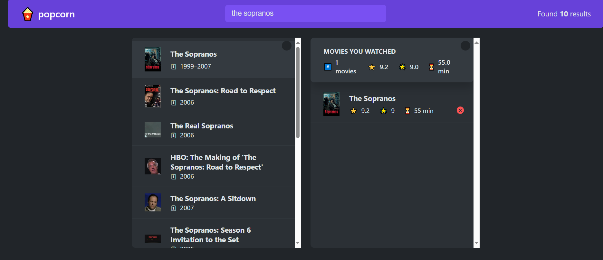

## Features

- Movie Search: Users can search for movies by entering a query in the search bar.
- Movie Details: View detailed information about a selected movie, including title, year, runtime, IMDb rating, plot, and cast.
- Add to Watched List: Users can add movies to a watched list and rate them.
- Watched List Summary: Provides a summary of the watched movies, including average IMDb rating, user rating, and total runtime.
- Persistent Storage: The watched list is stored in local storage, ensuring data persistence across sessions.
- Responsive Design: The application is designed to be responsive and works well on various devices.

## Technologies Used

- React: A JavaScript library for building user interfaces.
- Custom Hooks: For managing state and local storage.
- OMDb API: Used for fetching movie data.
- CSS: Styling the application.

## Installation

- Clone the repository:

- git clone https://github.com/Ahmed-K-Fouda/popcorn-movie
- cd movie-search-rating-app

- Install the dependencies:

- npm install

- Start the development server:

- npm start

## Usage

- Enter a movie name in the search bar to search for movies.
- Click on a movie to view detailed information.
- Add the movie to your watched list by rating it.
- View and manage your watched list, including deleting movies from the list.

## Project Structure

    src
        components

- Box.js: A reusable component for collapsible boxes.
- ErrorMessage.js: A component for displaying error messages.
- Loader.js: A loader component displayed during data fetching.

- Logo.js: A logo component for the application.
- Main.js: The main content wrapper component.
- Movie.js: A component for displaying individual movie details.
- MovieDetails.js: A component for fetching and displaying detailed movie information.
- MovieList.js: A component for displaying a list of movies.
- NavBar.js: A navigation bar component.
- NumResult.js: A component for displaying the number of search results.
- Search.js: A search bar component.
- StarRating.js: A component for rating movies with stars.
- WatchedMovie.js: A component for displaying individual watched movies.
- WatchedMovieList.js: A component for displaying the list of watched movies.
- WatchedSummary.js: A component for displaying a summary of watched movies.
- hooks
- useKey.js: A custom hook for handling keyboard events.
- useLocalStorageState.js: A custom hook for managing state with local storage.
- useMovies.js: A custom hook for fetching movies from the OMDb API.
- App.js: The main application component.
- index.js: The entry point of the application.
- index.css: The main stylesheet.

## Screenshots

## Live Demo

Check out the live demo [here]
